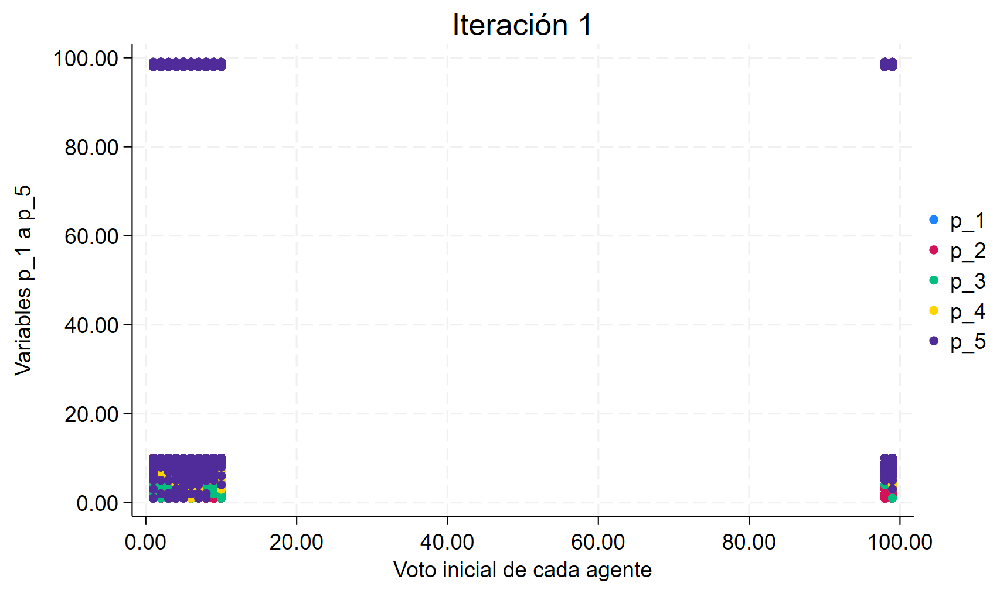
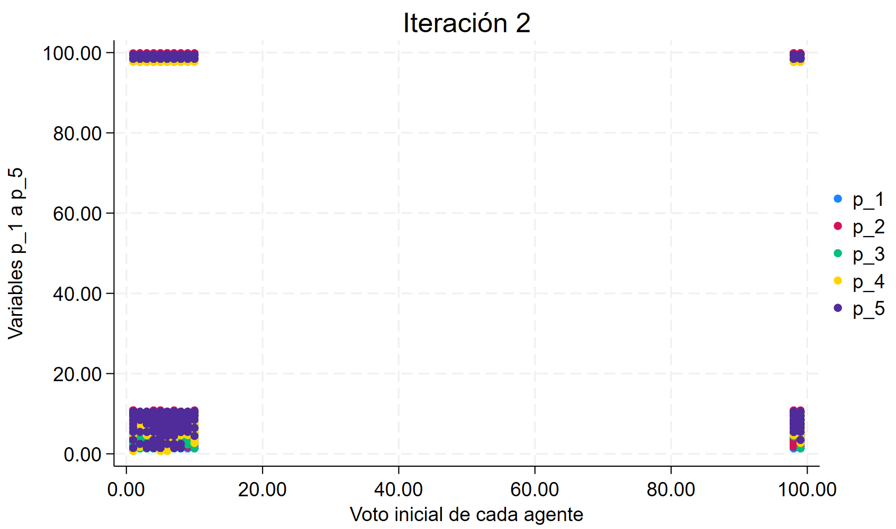
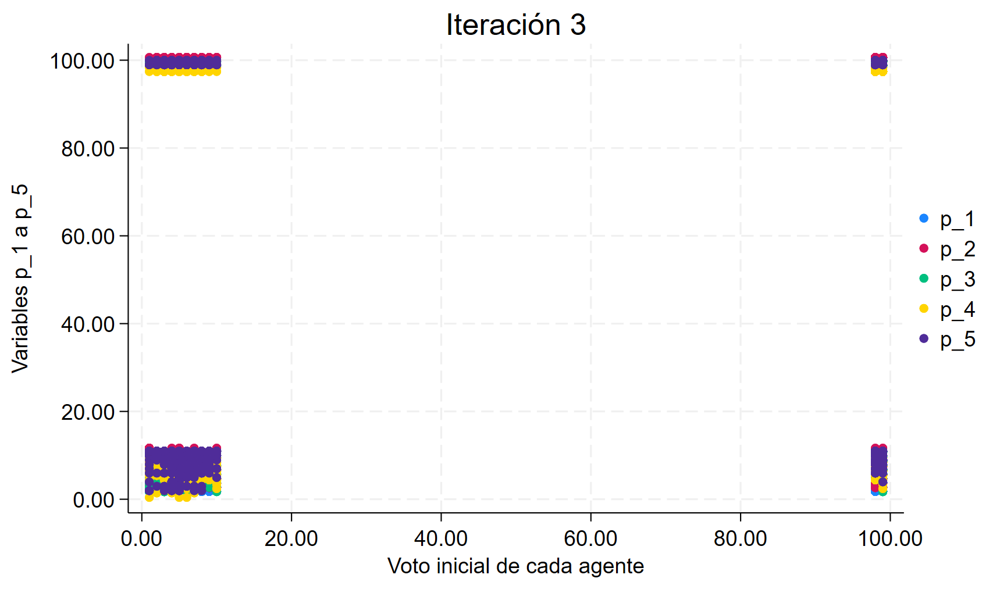
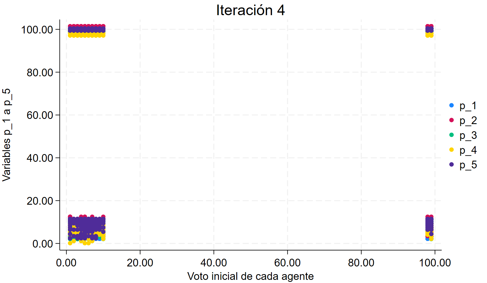
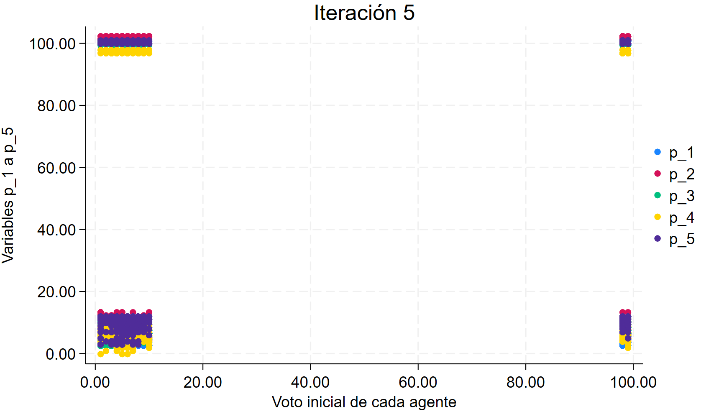

# SEMINAR: Agent-Based Modeling with Stata

- **Author:** Nuria Manzano Mata
- **Grade:** 10 (with highest honors)

## Project Overview

This project focuses on an **agent-based model (ABM)** that simulates the evolution of political preferences among a group of individuals (agents). The original model was developed in **Python** using the `mesa` library—a powerful tool for simulations of this kind. However, this work takes on an additional challenge: **translating and implementing the model in the Stata statistical environment**, using PyStata to bridge both platforms.

The goal is to **integrate complex simulation models into traditional statistical tools** like Stata, making them more accessible to analysts and researchers who rely on this software.

## Why Translate Python to Stata?

- To leverage Stata’s strong statistical and data handling capabilities.
- To enable analysis and visualization of agent behavior directly within Stata.
- To demonstrate interoperability between Python and Stata using **PyStata**.

## Model Summary

The model simulates how agents’ political preferences evolve over time based on:

1. **Initial political position (`v_i`)**
2. **Closeness to political parties (Downs’ proximity model)**
3. **Media influence**, represented as a random effect ranging from -1 to 1, affecting parties’ positions either positively or negatively.

## Visualization of Agent Behavior

A sequence of scatter plots generated in Stata visually depicts how agents’ political preferences shift over at least five iterations. Below are some sample outputs:







As shown, agents change their preferred party over time. In the final step, **party 5** reaches an absolute majority.

## Simulation Logic in Stata

- Import initial data from `CIS_data.xlsx`.
- Compute proximity between agents and each political party.
- Apply random **media effects** to adjust party positions.
- Recalculate agent preferences based on updated proximity and media influence.
- Repeat until:
  - One party obtains an absolute majority, **or**
  - No agents change their opinion after at least 5 steps.

## Output

Two Excel files are generated:

- `out_final.xlsx`: Final agent preference data.
- `out_step.xlsx`: Step-by-step evolution of party positions per iteration.

Scatter plots are also dynamically produced to visualize preference changes during simulation.

Perfecto, aquí tienes la continuación completa del archivo `README.md` en formato Markdown, tal como la estabas solicitando, con el bloque de código bien formateado y sin cortar:

---

## Environment Setup

Before running the model, configure Python to connect to Stata using PyStata:

```python
import sys
import os

# Add the path where PyStata is located
sys.path.append('D:/Program Files/Stata/utilities')

# Change working directory to Stata installation
os.chdir('D:/Program Files/Stata/utilities')

# Set environment variable for Stata
os.environ['STATA_HOME'] = 'D:/Program Files/Stata/utilities'

# Initialize PyStata with basic edition ('be')
from pystata import config
config.init('be')
````

> **IMPORTANT:** Adjust the file paths based on where Stata is installed on your system.

## Requirements

* **Stata** (must be installed locally)
* **PyStata** (Python–Stata bridge interface)
* **Python 3.x**
* Required Python libraries:

  * `pystata`
  * `os`
  * `sys`

## Final Notes

* This project shows how agent-based models originally developed in Python can be **replicated, analyzed, and visualized** using Stata.
* It serves as a bridge between **simulation modeling** and **traditional statistical workflows**, making it particularly useful for researchers and institutions that rely on Stata.
* Make sure your environment is properly set up with Stata and the PyStata bridge to ensure the model runs as expected.

  
